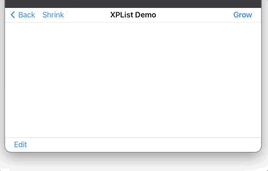

# XPList

Cross(X) Platform List in SwiftUI

## What is this

I ran into an issue with the regular SwiftUI.List when I was making my own collection. It basically doesn't work as far as I can tell. When using a type class that conforms to RandomAccessCollection as a datasource for List causes the app to crash whenever rows are removed from the data. Take a look at this [GIST](https://gist.github.com/jeffreybergier/0a366e173a871c1a8f3828824dbf7a54) to see a simple app that replicates the issue on macOS and iOS.

I was investigating using LazyVStack and ForEach (which does work in the GIST above) as a way to make my own "crappy" list. And then I realized that List in SwiftUI is not great to use when the code is cross platform as the macOS and iOS have such different concepts about selecting and opening data in a list. So I decided to go ahead and make XPList. It solves the crashing issue of using real list and it also solves the interaction issues by abstracting the interaction models.

### What this improves

In general, I tried to take behavior that is different between iOS and macOS and abstract it. In this way, the same API surface is used but different behavior is seen by the user. For example:

- OpenAction abstract tap and double click
    - macOS provides multiple items when double clicking, iOS provides only 1 item
- iOS supports edit mode
    - Selection is not shown when not in edit mode on iOS
    - Tap behavior causes selection on iOS not OpenAction
- Context Menu / Right Click details are abstracted away
    - Details about multi-selection and which item was right clicked match macOS expectations
- Theming is fully supported, XPL.Configuration contains all colors
    - Defaults match NSColor and UIColor special dynamic / system ui colors
- Easier to adjust your rows based on selection
    - Add `@Environment(\.XPL_isSelected) var isSelected` to your rows to detect selection
    - As far as I know, this is not possible with SwiftUI.List


### Notable Problems

List / TableView have many many features and so it would be hard to recreate them all. Noticable omissions right now include:

- Keyboard navigation
    - Arrows keys
    - Return key
- Multiselection with shift key
    - This works as expected with command key
- Tap gestures on macOS suck and so click and double-click actions feel like they take forever
- Animations work by fading cells in. No right or left appearance like with SwiftUI.List

### GIFs




## How to use

``` swift
import SwiftUI
import XPList

struct ContentView: View {
    @State var myData: [MyElement] = []
    @State var selection = Set<MyElement>()
    var body: some View {
        XPL.List(data: self.myData,
                 selection: self.mySelection,
                 open: { self.open($0) },
                 menu: { self.menu($0) })
        { element in
            HStack {
                Text(String(describing: element))
                Spacer()
            }
        }
    }
}
```

### Details

- Customize appearance by configuring the environment.
    - On the closing `}` for the List, add 
    `.environment(\.XPL_Configuration, myConfiguration)`
    - See `XPL.Configuration` for details on what can be customized.
- Selection, Open, and Menu are all optional properties in the initializer
- Foreground colors are set in the rows based on the configuration
    - Override them, but if you do, make sure you check if the cell is selected
    - `@Environment(\.XPL_isSelected) var isSelected`
    - macOS expects different colors for text in the row when its selected
